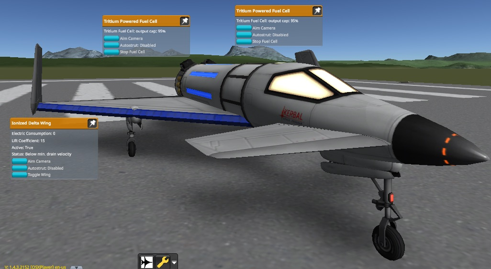

# Impossible Innovations

This mod adds some late-game engines and tanks to the game. These parts are fusion-based or use advanced technologies.

Now under New Management by Lisias. :)

## In a Hurry

* [Latest Release](https://github.com/net-lisias-ksp/ImpossibleInnovations/releases)
    + [Binaries](https://github.com/net-lisias-ksp/ImpossibleInnovations/tree/Archive)
* [Source](https://github.com/net-lisias-ksp/ImpossibleInnovations)
* [Issue Tracker](https://github.com/net-lisias-ksp/ImpossibleInnovations/issues)
* Documentation	
	+ [Homepage](http://ksp.lisias.net/add-ons/ImpossibleInnovations) on L Aerospace KSP Division
	+ [Forum](https://forum.kerbalspaceprogram.com/index.php?/topic/175694-141-impossible-innovations-under-new-management/)
	+ [Project's README](https://github.com/net-lisias-ksp/ImpossibleInnovations/blob/master/README.md)
	+ [Change Log](./CHANGE_LOG.md)
	+ [TODO](./TODO.md) list
* Official Distribution Sites:
	+ [Homepage](http://ksp.lisias.net/add-ons/ImpossibleInnovations) on L Aerospace
	+ [SpaceDock](https://spacedock.info/mod/340/Impossible%20Innovations)
	+ [CurseForge](https://kerbal.curseforge.com/projects/impossible-innovations)
	+ [Source and Binaries](https://github.com/net-lisias-ksp/ImpossibleInnovations) on GitHub.

## Description

This add in is useful for providing some functions that make interacting with the KSP API functionally nicer and with an improved interface. 

### Sample Crafts

* 
	+ Impossible Innovations/R
	+ Pretty standard multistage rocket:
		- Maximum Thrust / Engage SAS
		- Hit Stage to engage Deuterium Engines
		- Hit Stage to engage boosters and release clamps
		- Incline her to 5° as soon as she lift off - to prevent the boosters to falling over KSC.
* 
	+ Impossible Innovations/A
	+ An Aeris 3A modified to use Ionized Wings and Deuterium rocket engine.
		- Engage the Tritium Fuel Cells before taking off, or the wings will not work properly!  

And more on [KerbalX](https://kerbalx.com/hangars/44338) (soon also on Steam Workshop).

## Installation

To install, place the GameData folder inside your Kerbal Space Program folder.

**REMOVE ANY OLD VERSIONS OF THE PRODUCT BEFORE INSTALLING**.

### Dependencies

* [KSP API Extensions/L](https://github.com/net-lisias-ksp/KSPAPIExtensions) 2.0 or later
	+ Included
		- (do not overwrite if you download a new version from the Official Distribution Site)
* Module Manager 3.0.7 or later
	+ Included
		- Do not unzip this if you use my [Unofficial fork](https://github.com/net-lisias-kspu/ModuleManager). 
* TweakScale 2.3 or later
	+ Included
		- Do not unzip this if you use my [Unofficial fork](https://github.com/net-lisias-kspu/ModuleManager). 

## UPSTREAM

* [jandcando](https://forum.kerbalspaceprogram.com/index.php?/profile/66121-jandcando/): ROOT
	+ [Forum](https://forum.kerbalspaceprogram.com/index.php?/topic/77933-12-impossible-innovations-0876/&tab=comments#comment-1262281)
	+ [GitHub](https://github.com/JandCandO/ImpossibleInnovations)
