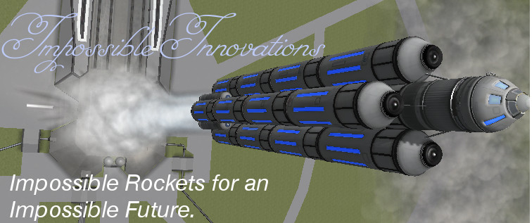

# Impossible Innovations

This mod adds some late-game engines and tanks to the game. These parts are fusion-based or use advanced technologies.

Now under New Management by Lisias. :)

## In a Hurry

* [Latest Release](https://github.com/net-lisias-ksp/ImpossibleInnovations/releases)
    + [Binaries](https://github.com/net-lisias-ksp/ImpossibleInnovations/tree/Archive)
* [Source](https://github.com/net-lisias-ksp/ImpossibleInnovations)
* [Issue Tracker](https://github.com/net-lisias-ksp/ImpossibleInnovations/issues)
* Documentation	
	+ [Homepage](http://ksp.lisias.net/add-ons/ImpossibleInnovations) on L Aerospace KSP Division
	+ [Forum](https://forum.kerbalspaceprogram.com/index.php?/topic/175694-141-impossible-innovations-under-new-management/)
	+ [Project's README](https://github.com/net-lisias-ksp/ImpossibleInnovations/blob/master/README.md)
	+ [Install Instructions](https://github.com/net-lisias-ksp/ImpossibleInnovations/blob/master/INSTALL.md)
	+ [Change Log](./CHANGE_LOG.md)
	+ [Known Issues](./KNOWN_ISSUES.md)
	+ [TODO](./TODO.md) list
* Official Distribution Sites:
	+ [Homepage](http://ksp.lisias.net/add-ons/ImpossibleInnovations) on L Aerospace
	+ [SpaceDock](https://spacedock.info/mod/340/Impossible%20Innovations)
	+ [CurseForge](https://kerbal.curseforge.com/projects/impossible-innovations)
	+ [Source and Binaries](https://github.com/net-lisias-ksp/ImpossibleInnovations) on GitHub.

## Description

This add in is useful for providing some functions that make interacting with the KSP API functionally nicer and with an improved interface. 

### Configuration

On the folder `<KSP_ROOT>/PluginData/ImpossibleInnovations` you will find a file called `user.cfg` where you can turn off the specialized II Category Filter on the VAB/SPH Advanced Menu. Set it to "NONE" or "CLASSIC" to deactivate or to activate the option.

This feature is useful if you want to use [Community Category Filter](https://forum.kerbalspaceprogram.com/index.php?/topic/149840-discussion-community-category-kit/), as it will declutter the Advanced Menu.

### Sample Crafts

* 
	+ Impossible Innovations/R
	+ Pretty standard multistage rocket:
		- Maximum Thrust / Engage SAS
		- Hit Stage to engage Deuterium Engines
		- Hit Stage to engage boosters and release clamps
		- Incline her to 5° as soon as she lift off - to prevent the boosters from falling over KSC.
* 
	+ Impossible Innovations/A
	+ An Aeris 3A modified to use Ionized Wings and Deuterium rocket engine.
		- Engage the Tritium Fuel Cells before taking off, or the wings will not work properly!  

And more on [KerbalX](https://kerbalx.com/hangars/44338) (soon also on Steam Workshop).

## Installation

Detailed installation instructions are now on its own file (see the [In a Hurry](#in-a-hurry) section) and on the distribution file.

### License

Impossible Innovations is licensed as follows:

* Source Code and TweakScale Patches:
	+ [SKL 1.0](https://ksp.lisias.net/SKL-1_0.txt). See [here](./LICENSE.SKL-1_0)
		- You are free to:
			- Use : unpack and use the material in any computer or device
			- Redistribute : redistribute the original package in any medium
		- Under the following terms:
			- You agree to use the material only on (or to) KSP
			- You don't alter the package in any form or way (but you can embedded it)
			- You don't change the material in any way, and retain any copyright notices
			- You must explicitly state the author's Copyright, as well an Official Site for downloading the original and new versions (the one you used to download is good enough)
	+ [GPL 2.0](https://www.gnu.org/licenses/gpl-2.0.txt). See [here](./LICENSE.GPL-2_0)
		- You are free to:
			- Use : unpack and use the material in any computer or device
			- Redistribute : redistribute the original package in any medium
			- Adapt : Reuse, modify or incorporate source code into your works (and redistribute it!) 
		- Under the following terms:
			- You retain any copyright notices
			- You recognise and respect any trademarks
			- You don't impersonate the authors, neither redistribute a derivative that could be misrepresented as theirs.
			- You credit the author and republish the copyright notices on your works where the code is used.
			- You relicense (and fully comply) your works using GPL 2.0 (or later)
			- You don't mix your work with GPL incompatible works.
		- If by some reason the GPL would be unenforceable for you, rest assured that you still retain the right to Use the Work under SKL 1.0. 
	+ And you are allowed to choose the License that better suit your needs.
* Models, Textures, Art & Configs:
	+ [CC BY-NC-SA 4.0]() See [here](./LICENSE.CC_NC-SA-4_0)
		- You are free to:
			- Share : copy and redistribute the material in any medium or format
			- Adapt : remix, transform, and build upon the material
		- Under the following terms:
			- Attribution : You must give appropriate credit, provide a link to the license, and indicate if changes were made. You may do so in any reasonable manner, but not in any way that suggests the licensor endorses you or your use.
			- NonCommercial : You may not use the material for commercial purposes.
			- ShareAlike : If you remix, transform, or build upon the material, you must distribute your contributions under the same license as the original.

Please note the copyrights and trademarks in [NOTICE](./NOTICE).

## References

* [jandcando](https://forum.kerbalspaceprogram.com/index.php?/profile/66121-jandcando/): ROOT
	+ [Forum](https://forum.kerbalspaceprogram.com/index.php?/topic/77933-12-impossible-innovations-0876/&tab=comments#comment-1262281)
	+ [GitHub](https://github.com/JandCandO/ImpossibleInnovations)
